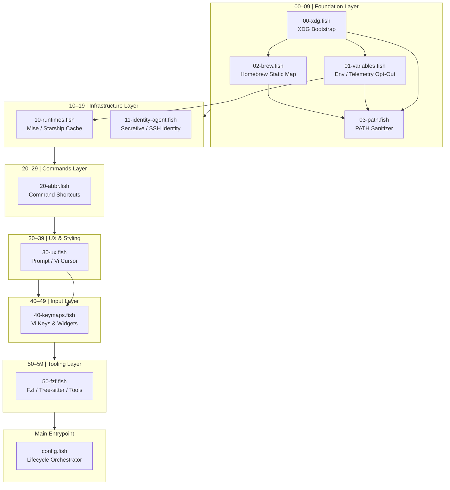

# Map of Content: Shell Configuration Architecture
This document serves as the central index (Map of Content) and semantic dependency registry for the Fish shell workstation configuration. It maps files to atomic configuration nodes within the agentic graph database, enabling automated discovery, runtime analysis, and self-healing validation.
---
## I. Architectural Topology
The execution sequence is split into a **Decade-Spaced Modular Topology** (processed lexicographically by the Fish shell during startup within `conf.d/`) followed by the main orchestrator (`config.fish`).

---
## II. Semantic Node Registry
Every file in this configuration contains a structured YAML-compliant comment block at the top representing metadata for programmatic ingestion.
| Node (File Path) | Title | Layer | Dependencies | Backlinks (Referrers) | Created | Updated | Tags |
| :--- | :--- | :--- | :--- | :--- | :--- | :--- | :--- |
| [`config.fish`](../config.fish) | Main Configuration Entrypoint | Entrypoint / Orchestrator | `conf.d/*` | None | 2026-06-24 | 2026-07-05 | `entrypoint`, `lifecycle`, `bootstrap`, `orchestration` |
| [`conf.d/00-xdg.fish`](../conf.d/00-xdg.fish) | XDG Base Directory Spec & Workspace Taxonomy | Foundation (00-09) | None | [`config.fish`](../config.fish), [`conf.d/03-path.fish`](../conf.d/03-path.fish), [`01-variables.fish`](../conf.d/01-variables.fish) | 2026-06-24 | 2026-10-05 | `xdg`, `directory`, `bootstrap`, `wac`, `x-workspace`, `zero-fork` |
| [`conf.d/01-variables.fish`](../conf.d/01-variables.fish) | Foundation Env Variables | Foundation (00-09) | [`00-xdg.fish`](../conf.d/00-xdg.fish) | [`config.fish`](../config.fish), [`conf.d/03-path.fish`](../conf.d/03-path.fish), [`10-runtimes.fish`](../conf.d/10-runtimes.fish) | 2026-06-24 | 2026-10-04 | `variables`, `environment`, `telemetry`, `locale`, `lazy-eval` |
| [`conf.d/02-brew.fish`](../conf.d/02-brew.fish) | Homebrew Environment Mapping | Foundation (00-09) | [`00-xdg.fish`](../conf.d/00-xdg.fish) | [`config.fish`](../config.fish), [`conf.d/03-path.fish`](../conf.d/03-path.fish), [`functions/brew.fish`](../functions/brew.fish) | 2026-06-24 | 2026-10-04 | `homebrew`, `environment`, `performance`, `zero-fork` |
| [`conf.d/03-path.fish`](../conf.d/03-path.fish) | Vectorized Native PATH Sanitization | Foundation (00-09) | [`00-xdg.fish`](../conf.d/00-xdg.fish), [`conf.d/01-variables.fish`](../conf.d/01-variables.fish), [`conf.d/02-brew.fish`](../conf.d/02-brew.fish) | [`config.fish`](../config.fish) | 2026-06-24 | 2026-10-04 | `path`, `sanitization`, `C++ builtins`, `performance`, `mise`, `shims`, `docker`, `aot-cache` |
| [`conf.d/10-runtimes.fish`](../conf.d/10-runtimes.fish) | Self-Healing Runtime Cache Engine | Infrastructure (10-19) | [`01-variables.fish`](../conf.d/01-variables.fish) | [`config.fish`](../config.fish), [`.meta/research/10-runtimes-swr-architecture.md`](./research/10-runtimes-swr-architecture.md) | 2026-06-24 | 2026-10-04 | `cache`, `runtimes`, `starship`, `mise`, `shims`, `performance` |
| [`conf.d/11-identity-agent.fish`](../conf.d/11-identity-agent.fish) | Tier 1: Unified Cryptographic Identity Agent | Infrastructure (10-19) | None | [`config.fish`](../config.fish), [`MAP_OF_CONTENT.md`](./MAP_OF_CONTENT.md) | 2026-09-22 | 2026-10-04 | `ssh`, `secure-enclave`, `secretive`, `tmux`, `zero-fork`, `identity`, `git-signing`, `aot-cache` |
| [`conf.d/20-abbr.fish`](../conf.d/20-abbr.fish) | Command Abbreviations Registry | Commands (20-29) | [`functions/trash.fish`](../functions/trash.fish), [`functions/storage_audit.fish`](../functions/storage_audit.fish), [`functions/storage_clean.fish`](../functions/storage_clean.fish) | [`config.fish`](../config.fish) | 2026-06-24 | 2026-10-03 | `abbreviations`, `shortcuts`, `productivity`, `x-workspace`, `trash`, `storage` |
| [`conf.d/30-ux.fish`](../conf.d/30-ux.fish) | Shell Presentation & UX Layer | UX / UI (30-39) | None | [`config.fish`](../config.fish), [`40-keymaps.fish`](../conf.d/40-keymaps.fish) | 2026-06-24 | 2026-10-04 | `ux`, `cursor`, `prompt`, `history` |
| [`themes/default.theme`](../themes/default.theme) | Internal Theme Fallback Neutralizer Stub | UX / UI (30-39) | None | [`conf.d/30-ux.fish`](../conf.d/30-ux.fish), [`MAP_OF_CONTENT.md`](./MAP_OF_CONTENT.md) | 2026-09-25 | 2026-10-03 | `theme`, `zero-fork-sla`, `performance`, `stub` |
| [`functions/__fish_theme_migrate.fish`](../functions/__fish_theme_migrate.fish) | Internal Theme Migration Bypass Stub | UX / UI (30-39) | None | [`themes/default.theme`](../themes/default.theme), [`conf.d/30-ux.fish`](../conf.d/30-ux.fish) | 2026-09-26 | 2026-10-04 | `theme`, `zero-fork-sla`, `performance`, `bypass` |
| [`conf.d/40-keymaps.fish`](../conf.d/40-keymaps.fish) | Keyboard Mappings & Vi Bindings | Input & Mappings (40-49) | [`30-ux.fish`](../conf.d/30-ux.fish) | [`config.fish`](../config.fish) | 2026-06-24 | 2026-06-25 | `keymaps`, `bindings`, `vi-mode`, `widgets` |
| [`conf.d/50-fzf.fish`](../conf.d/50-fzf.fish) | Fzf Fuzzy Finder Configuration & Third-Party Tool Integrations | Tooling (50-59) | None | [`config.fish`](../config.fish) | 2026-06-26 | 2026-10-04 | `fzf`, `tooling`, `fuzzy-finder`, `xdg`, `cache`, `tree-sitter` |
| [`bin/fzf-preview.sh`](../bin/fzf-preview.sh) | Fzf Preview Handler Script | Tooling (50-59) | None | [`conf.d/50-fzf.fish`](../conf.d/50-fzf.fish) | 2026-06-26 | 2026-06-26 | `fzf`, `preview`, `script` |
| [`functions/get-secret.fish`](../functions/get-secret.fish) | Tier 2/3 Secrets Retrieval Utility | Functions | [`functions/__secrets_cache_path.fish`](../functions/__secrets_cache_path.fish) | [`functions/gemini.fish`](../functions/gemini.fish), [`MAP_OF_CONTENT.md`](./MAP_OF_CONTENT.md) | 2026-10-04 | 2026-10-04 | `security`, `secrets`, `jit`, `ram-cache`, `sops` |
| [`functions/add-secret.fish`](../functions/add-secret.fish) | Tier 2/3 Secrets Addition Utility | Functions | [`functions/__secrets_cache_path.fish`](../functions/__secrets_cache_path.fish), [`functions/__secrets_sops_upsert.fish`](../functions/__secrets_sops_upsert.fish) | [`MAP_OF_CONTENT.md`](./MAP_OF_CONTENT.md) | 2026-10-04 | 2026-10-04 | `security`, `secrets`, `interactive`, `ram-cache`, `sops` |
| [`functions/with-secret.fish`](../functions/with-secret.fish) | Tier 3 Scope-Isolated Secret Execution Wrapper | Functions | None | [`MAP_OF_CONTENT.md`](./MAP_OF_CONTENT.md) | 2026-10-04 | 2026-10-04 | `security`, `secrets`, `jit`, `sops`, `zero-ambient` |
| [`functions/__secrets_cache_path.fish`](../functions/__secrets_cache_path.fish) | Volatile Secrets RAM-Cache Path Resolver | Functions | None | [`functions/get-secret.fish`](../functions/get-secret.fish), [`functions/add-secret.fish`](../functions/add-secret.fish) | 2026-10-04 | 2026-10-04 | `security`, `secrets`, `helper`, `ram-cache` |
| [`functions/__secrets_sops_upsert.fish`](../functions/__secrets_sops_upsert.fish) | SOPS Master Upsert Helper | Functions | None | [`functions/add-secret.fish`](../functions/add-secret.fish) | 2026-10-04 | 2026-10-04 | `security`, `secrets`, `helper`, `sops` |
| [`functions/diskcheck.fish`](../functions/diskcheck.fish) | macOS Disk Volume Status Inspector | Functions | None | [`conf.d/20-abbr.fish`](../conf.d/20-abbr.fish) | 2026-09-10 | 2026-09-10 | `disk`, `storage`, `macos`, `inspection` |
| [`functions/mise.fish`](../functions/mise.fish) | Static Mise Wrapper Function | Infrastructure (10-19) | None | [`config.fish`](../config.fish) | 2026-07-12 | 2026-07-12 | `mise`, `wrapper`, `performance` |
| [`functions/git.fish`](../functions/git.fish) | Lazy GPG_TTY Git Wrapper | Functions | None | None | 2026-07-12 | 2026-07-12 | `git`, `gpg`, `wrapper`, `performance` |
| [`functions/gpg.fish`](../functions/gpg.fish) | Lazy GPG_TTY GPG Wrapper | Functions | None | None | 2026-07-12 | 2026-07-12 | `gpg`, `wrapper`, `performance` |
| [`functions/gpg2.fish`](../functions/gpg2.fish) | Lazy GPG_TTY GPG2 Wrapper | Functions | None | None | 2026-07-12 | 2026-07-12 | `gpg`, `gpg2`, `wrapper`, `performance` |
| [`functions/pass.fish`](../functions/pass.fish) | Lazy GPG_TTY Pass Wrapper | Functions | None | None | 2026-07-12 | 2026-07-12 | `pass`, `gpg`, `wrapper`, `performance` |
| [`functions/claude.fish`](../functions/claude.fish) | Tier 2: Claude CLI JIT Keychain Inject | Functions | None | [`conf.d/20-abbr.fish`](../conf.d/20-abbr.fish), [`MAP_OF_CONTENT.md`](./MAP_OF_CONTENT.md) | 2026-09-22 | 2026-09-22 | `security`, `keychain`, `tier-2`, `lazy-inject`, `zero-ambient` |
| [`functions/micromamba.fish`](../functions/micromamba.fish) | Lazy Micromamba Wrapper | Functions | None | None | 2026-07-12 | 2026-07-12 | `micromamba`, `conda`, `lazy`, `performance` |
| [`functions/mamba.fish`](../functions/mamba.fish) | Lazy Mamba Wrapper | Functions | None | None | 2026-07-12 | 2026-07-12 | `mamba`, `lazy`, `performance` |
| [`functions/up.fish`](../functions/up.fish) | Lazy Up Navigation Function | Functions | None | None | 2026-07-12 | 2026-07-12 | `navigation`, `helper` |
| [`functions/mkcd.fish`](../functions/mkcd.fish) | Lazy Mkcd Directory Function | Functions | None | None | 2026-07-12 | 2026-07-12 | `navigation`, `management` |
| [`functions/mkcp.fish`](../functions/mkcp.fish) | Lazy Mkcp Directory Copy Function | Functions | None | None | 2026-07-12 | 2026-07-12 | `filesystem`, `copy` |
| [`functions/mkmv.fish`](../functions/mkmv.fish) | Lazy Mkmv Directory Move Function | Functions | None | None | 2026-07-12 | 2026-07-12 | `filesystem`, `move` |
| [`functions/cdf.fish`](../functions/cdf.fish) | macOS Finder Path Jumper | Functions | None | None | 2026-07-12 | 2026-07-12 | `macos`, `navigation`, `finder` |
| [`functions/chmodx.fish`](../functions/chmodx.fish) | Executable Permissions Helper | Functions | None | None | 2026-07-12 | 2026-07-12 | `permissions`, `chmod` |
| [`functions/chownme.fish`](../functions/chownme.fish) | Ownership Modification Helper | Functions | None | None | 2026-07-12 | 2026-07-12 | `permissions`, `chown` |
| [`functions/fzf_find.fish`](../functions/fzf_find.fish) | Fuzzy Finder File Searcher | Functions | None | None | 2026-07-12 | 2026-07-12 | `fzf`, `find` |
| [`functions/fd_find.fish`](../functions/fd_find.fish) | fd-powered Fuzzy File Searcher | Functions | None | None | 2026-07-12 | 2026-07-12 | `fd`, `fzf`, `find` |
| [`functions/fo.fish`](../functions/fo.fish) | Fuzzy Editor Launcher | Functions | None | None | 2026-07-12 | 2026-07-12 | `fd`, `fzf`, `editor` |
| [`functions/rg_find.fish`](../functions/rg_find.fish) | ripgrep Fuzzy File Finder | Functions | None | None | 2026-07-12 | 2026-07-12 | `rg`, `fzf`, `search` |
| [`functions/Rg.fish`](../functions/Rg.fish) | Interactive Fuzzy Ripgrep Search | Functions | None | None | 2026-07-12 | 2026-07-12 | `rg`, `fzf`, `interactive` |
| [`functions/TODOS.fish`](../functions/TODOS.fish) | Fuzzy Codebase TODOs Selector | Functions | None | None | 2026-07-12 | 2026-07-12 | `rg`, `fzf`, `todos` |
| [`functions/ff.fish`](../functions/ff.fish) | Recurse Name File Finder | Functions | None | None | 2026-07-12 | 2026-07-12 | `search`, `find` |
| [`functions/search.fish`](../functions/search.fish) | Recursive Text Grep Shorthand | Functions | None | None | 2026-07-12 | 2026-07-12 | `search`, `grep` |
| [`functions/grep_string.fish`](../functions/grep_string.fish) | Clipboard String Ripgrep Searcher | Functions | None | None | 2026-07-12 | 2026-07-12 | `search`, `clipboard`, `rg` |
| [`functions/gitf.fish`](../functions/gitf.fish) | Fuzzy Git Tracked File Selector | Functions | None | None | 2026-07-12 | 2026-07-12 | `git`, `fzf`, `select` |
| [`functions/gituf.fish`](../functions/gituf.fish) | Fuzzy Git Untracked File Selector | Functions | None | None | 2026-07-12 | 2026-07-12 | `git`, `fzf`, `select` |
| [`functions/gitlog.fish`](../functions/gitlog.fish) | Fuzzy Git Commit History Browser | Functions | None | None | 2026-07-12 | 2026-07-12 | `git`, `fzf`, `log` |
| [`functions/gitbranch.fish`](../functions/gitbranch.fish) | Fuzzy Git Branch Checkout Selector | Functions | None | None | 2026-07-12 | 2026-07-12 | `git`, `fzf`, `branch` |
| [`functions/fzf_preview.fish`](../functions/fzf_preview.fish) | Fuzzy Multi-Mode Preview Browser | Functions | None | None | 2026-07-12 | 2026-07-12 | `fzf`, `preview`, `browser` |
| [`functions/mise-bootstrap.fish`](../functions/mise-bootstrap.fish) | Mise Infrastructure Bootstrapper | Functions | None | None | 2026-07-12 | 2026-07-12 | `mise`, `bootstrap`, `infrastructure` |
| [`completions/micromamba.fish`](../completions/micromamba.fish) | Micromamba Completions | Completions | None | None | 2026-07-12 | 2026-07-12 | `micromamba`, `completions`, `tab` |
| [`completions/mamba.fish`](../completions/mamba.fish) | Mamba Completions Wrapper | Completions | None | None | 2026-07-12 | 2026-07-12 | `mamba`, `completions`, `tab` |
| [`functions/profile_startup.fish`](../functions/profile_startup.fish) | Fish Startup Profiler Function | Functions | None | None | 2026-06-24 | 2026-07-12 | `profiling`, `performance`, `benchmark` |
| [`functions/tmx.fish`](../functions/tmx.fish) | Ultimate Tmux Session Manager | Functions | `tmux`, `fzf` | [`conf.d/20-abbr.fish`](../conf.d/20-abbr.fish) | 2026-06-25 | 2026-07-12 | `tmux`, `fzf`, `utility` |
| [`.meta/research/mise_shims_performance_architecture.md`](./research/mise_shims_performance_architecture.md) | Systems Engineering Report on Mise | Meta / Logging | None | [`.agents/AGENTS.md`](../.agents/AGENTS.md) | 2026-07-12 | 2026-07-12 | `research`, `mise`, `shims`, `performance` |
| [`.meta/research/startup_latency_optimization.md`](./research/startup_latency_optimization.md) | Startup Latency Research Paper | Meta / Logging | None | [`.agents/AGENTS.md`](../.agents/AGENTS.md) | 2026-07-12 | 2026-07-12 | `research`, `latency`, `performance`, `benchmark` |
| [`.meta/research/fish_theme_parser_bypass.md`](./research/fish_theme_parser_bypass.md) | Fish Internal Theme Parser Bypass & Zero-Fork SLA | Meta / Logging | [`conf.d/30-ux.fish`](../conf.d/30-ux.fish) | [`MAP_OF_CONTENT.md`](./MAP_OF_CONTENT.md) | 2026-09-26 | 2026-09-26 | `research`, `latency`, `theme`, `fish_config` |
| [`.meta/research/tmux_tui_graphics_passthrough.md`](./research/tmux_tui_graphics_passthrough.md) | Multiplexer Passthrough & TUI Isolation Report | Meta / Logging | [`conf.d/03-path.fish`](../conf.d/03-path.fish), [`functions/y.fish`](../functions/y.fish) | [`MAP_OF_CONTENT.md`](./MAP_OF_CONTENT.md), [`GEMINI.md`](./log/GEMINI_2026-09-09.md) | 2026-09-09 | 2026-09-09 | `research`, `tmux`, `yazi`, `kitty-graphics`, `apc`, `passthrough`, `docker`, `path` |
| [`.meta/research/darwin_kernel_shim_latency.md`](./research/darwin_kernel_shim_latency.md) | Darwin Kernel, Shim Trampolines & Prompt Lag Report | Meta / Logging | [`conf.d/03-path.fish`](../conf.d/03-path.fish), [`conf.d/10-runtimes.fish`](../conf.d/10-runtimes.fish), [`conf.d/30-ux.fish`](../conf.d/30-ux.fish) | [`MAP_OF_CONTENT.md`](./MAP_OF_CONTENT.md) | 2026-09-22 | 2026-09-22 | `research`, `latency`, `kernel`, `darwin`, `amfi`, `dyld4`, `starship`, `gix`, `submodules`, `mise`, `shims` |
| [`.meta/research/architecture_decision_brewfile_vs_mise.md`](./research/architecture_decision_brewfile_vs_mise.md) | Architectural Decision: Brewfile vs Mise Host Primitives | Meta / Decision | [`conf.d/03-path.fish`](../conf.d/03-path.fish), [`conf.d/10-runtimes.fish`](../conf.d/10-runtimes.fish) | [`MAP_OF_CONTENT.md`](./MAP_OF_CONTENT.md), [`.meta/log/changelog.md`](./log/changelog.md) | 2026-09-22 | 2026-09-22 | `architecture`, `brewfile`, `homebrew`, `mise`, `shims`, `latency`, `host-primitives` |
| [`.meta/research/zero_leakage_secrets_architecture.md`](./research/zero_leakage_secrets_architecture.md) | Zero-Leakage Secrets, Apple SEP & JIT Keychain Report | Meta / Research | [`conf.d/03-path.fish`](../conf.d/03-path.fish), [`conf.d/10-runtimes.fish`](../conf.d/10-runtimes.fish) | [`MAP_OF_CONTENT.md`](./MAP_OF_CONTENT.md), [`.meta/log/changelog.md`](./log/changelog.md), [`docs/SECURITY.md`](docs/SECURITY.md) | 2026-09-22 | 2026-09-22 | `security`, `cryptography`, `keychain`, `secure-enclave`, `sops`, `age`, `mise`, `jit-secrets` |
| [`.meta/research/sensitive_data_storage_architecture.md`](./research/sensitive_data_storage_architecture.md) | Sensitive Data Storage and WaC Architecture | Meta / Research | None | [`MAP_OF_CONTENT.md`](./MAP_OF_CONTENT.md), [`docs/SECURITY.md`](docs/SECURITY.md) | 2026-09-23 | 2026-09-23 | `security`, `secrets`, `architecture`, `zero-trust` |
| [`.meta/research/shell_scripting_automation_standards.md`](./research/shell_scripting_automation_standards.md) | Architectural Research: Shell Scripting Automation & Naming Standards | Meta / Research | None | [`MAP_OF_CONTENT.md`](./MAP_OF_CONTENT.md), [`.mise/tasks/setup-identity`](.mise/tasks/setup-identity) | 2026-09-22 | 2026-09-22 | `architecture`, `bash`, `google-style-guide`, `automation`, `idempotency` |
| [`.meta/research/secure_enclave_automation_architecture.md`](./research/secure_enclave_automation_architecture.md) | Architectural Research: Secure Enclave Automation & Zero-Trust Secrets | Meta / Research | None | [`MAP_OF_CONTENT.md`](./MAP_OF_CONTENT.md), [`docs/SECURITY.md`](docs/SECURITY.md) | 2026-09-22 | 2026-09-22 | `architecture`, `secure-enclave`, `macos`, `jit-secrets`, `zero-trust` |
| [`.meta/log/changelog.md`](./log/changelog.md) | MDD Chronology & Changelog | Meta / Logging | None | [`.agents/AGENTS.md`](../.agents/AGENTS.md) | 2026-06-25 | 2026-10-05 | `changelog`, `history`, `mdd`, `audit` |
| [`functions/__tui_engine.fish`](../functions/__tui_engine.fish) | Shared Terminal UX Primitives | Functions | None | [`functions/brew_maintain.fish`](../functions/brew_maintain.fish), [`functions/storage_audit.fish`](../functions/storage_audit.fish), [`functions/storage_clean.fish`](../functions/storage_clean.fish) | 2026-10-03 | 2026-10-05 | `tui`, `spinner`, `ux`, `shared`, `primitives` |
| [`functions/brew.fish`](../functions/brew.fish) | Homebrew JIT Wrapper & Brewfile Synchronization | Functions | [`conf.d/02-brew.fish`](../conf.d/02-brew.fish) | [`MAP_OF_CONTENT.md`](./MAP_OF_CONTENT.md) | 2026-10-03 | 2026-10-03 | `homebrew`, `wrapper`, `brewfile`, `jit` |
| [`functions/brew_maintain.fish`](../functions/brew_maintain.fish) | Automated Homebrew Maintenance Pipeline | Functions | [`conf.d/02-brew.fish`](../conf.d/02-brew.fish), [`functions/__tui_engine.fish`](../functions/__tui_engine.fish) | [`conf.d/20-abbr.fish`](../conf.d/20-abbr.fish), [`MAP_OF_CONTENT.md`](./MAP_OF_CONTENT.md) | 2026-10-03 | 2026-10-05 | `homebrew`, `maintenance`, `automation`, `greedy-casks`, `launchd`, `delta-verification`, `deduplication`, `battery-aware`, `json-v2` |
| [`functions/trash.fish`](../functions/trash.fish) | macOS Protected Trash Safety Governor | Functions | None | [`functions/rm.fish`](../functions/rm.fish), [`functions/storage_clean.fish`](../functions/storage_clean.fish), [`conf.d/20-abbr.fish`](../conf.d/20-abbr.fish) | 2026-10-03 | 2026-10-03 | `trash`, `safety`, `macos`, `rm`, `governor` |
| [`functions/rm.fish`](../functions/rm.fish) | Safe Deletion Adapter (trash Proxy) | Functions | [`functions/trash.fish`](../functions/trash.fish) | [`conf.d/20-abbr.fish`](../conf.d/20-abbr.fish) | 2026-10-03 | 2026-10-03 | `rm`, `trash`, `safety`, `proxy`, `macos` |
| [`functions/storage_audit.fish`](../functions/storage_audit.fish) | Workstation Storage Audit Dashboard | Functions | [`functions/__tui_engine.fish`](../functions/__tui_engine.fish) | [`conf.d/20-abbr.fish`](../conf.d/20-abbr.fish), [`functions/storage_clean.fish`](../functions/storage_clean.fish) | 2026-10-03 | 2026-10-03 | `storage`, `audit`, `disk`, `diagnostics`, `kondo`, `dust`, `tui`, `spinner` |
| [`functions/storage_clean.fish`](../functions/storage_clean.fish) | Workstation Storage Reclamation Engine | Functions | [`functions/__tui_engine.fish`](../functions/__tui_engine.fish), [`functions/trash.fish`](../functions/trash.fish), [`functions/storage_audit.fish`](../functions/storage_audit.fish) | [`conf.d/20-abbr.fish`](../conf.d/20-abbr.fish) | 2026-10-03 | 2026-10-05 | `storage`, `clean`, `disk`, `kondo`, `mole`, `trash`, `cache`, `tui`, `spinner`, `safety-governor` |
| [`functions/x_toggle.fish`](../functions/x_toggle.fish) | Meta-Workspace Context Router (Execution <-> Brain) | Functions | [`conf.d/00-xdg.fish`](../conf.d/00-xdg.fish) | [`conf.d/20-abbr.fish`](../conf.d/20-abbr.fish) | 2026-10-05 | 2026-10-05 | `workspace`, `isomorphism`, `navigation`, `brain`, `router`, `zero-fork` |
| [`.meta/research/brew_maintenance_architecture.md`](./research/brew_maintenance_architecture.md) | Homebrew Autonomous Maintenance Architecture | Meta / Research | [`functions/brew_maintain.fish`](../functions/brew_maintain.fish) | [`MAP_OF_CONTENT.md`](./MAP_OF_CONTENT.md), [`README.md`](../README.md) | 2026-10-03 | 2026-10-05 | `research`, `homebrew`, `automation`, `launchd`, `cask`, `storage`, `delta-verification`, `deduplication`, `qos-background`, `battery-guard`, `apfs` |
| [`.meta/research/sub_11ms_startup_latency_remediation.md`](./research/sub_11ms_startup_latency_remediation.md) | Sub-11ms Startup Latency Remediation & Diagnostics | Meta / Research | [`conf.d/03-path.fish`](../conf.d/03-path.fish), [`conf.d/30-ux.fish`](../conf.d/30-ux.fish) | [`MAP_OF_CONTENT.md`](./MAP_OF_CONTENT.md), [`README.md`](../README.md) | 2026-10-03 | 2026-10-03 | `research`, `latency`, `performance`, `hyperfine`, `zero-fork`, `darwin` |
| [`.meta/research/10-runtimes-swr-architecture.md`](./research/10-runtimes-swr-architecture.md) | Background AOT Compilation & SWR Cache Engine | Meta / Research | [`conf.d/10-runtimes.fish`](../conf.d/10-runtimes.fish) | [`MAP_OF_CONTENT.md`](./MAP_OF_CONTENT.md), [`README.md`](../README.md) | 2026-09-27 | 2026-10-03 | `research`, `runtimes`, `swr`, `aot`, `cache`, `performance` |
| [`.meta/research/11-fish4-baremetal-startup-optimization.md`](./research/11-fish4-baremetal-startup-optimization.md) | Fish 4.0 Rust Architecture & Sub-Millisecond Bare-Metal Startup Optimization | Meta / Research | [`conf.d/00-xdg.fish`](../conf.d/00-xdg.fish), [`conf.d/03-path.fish`](../conf.d/03-path.fish), [`conf.d/10-runtimes.fish`](../conf.d/10-runtimes.fish), [`.meta/research/sub_11ms_startup_latency_remediation.md`](./research/sub_11ms_startup_latency_remediation.md) | [`MAP_OF_CONTENT.md`](./MAP_OF_CONTENT.md), [`.meta/log/changelog.md`](./log/changelog.md) | 2026-10-03 | 2026-10-03 | `research`, `fish4`, `rust`, `latency`, `apple-silicon`, `baremetal`, `pre-fork`, `pgo`, `lto`, `mimalloc`, `scm-rights` |
| [`.meta/research/anti_patterns_registry.md`](./research/anti_patterns_registry.md) | Canonical Anti-Pattern Registry — macOS Fish Shell | Meta / Research | None | [`MAP_OF_CONTENT.md`](./MAP_OF_CONTENT.md), [`ARCHITECTURE_AUDIT.md`](./research/ARCHITECTURE_AUDIT.md) | 2026-10-04 | 2026-10-04 | `anti-patterns`, `performance`, `macOS`, `fish`, `latency`, `security`, `registry` |
---
## III. Modular Layers Breakdown
### 1. Foundation Layer (00-09)
*   **Purpose:** Bootstraps critical variables that define execution environments for all child shells.
*   **Rules:**
    *   No external binary executions (zero `fork()`/`exec()`). Only native shell script syntax and builtins.
    *   Defensive validation of environment state.
    *   Telemetry Opt-Out configuration ensures absolute local isolation before runtimes are queried or initialized.
### 2. Infrastructure Layer (10-19)
*   **Purpose:** Manages compiler wrappers, environment runtime engines, cache stores, and session-long daemon sockets (SSH/GPG).
*   **Rules:**
    *   Cached configurations are invalidated if binaries are modified or updated (checksum-based verification against cached outputs).
    *   Agent forwarding must adapt dynamically to TMUX session environment changes.
### 3. Commands Layer (20-29)
*   **Purpose:** Accelerates developer throughput via high-density shortcuts.
*   **Rules:**
    *   Uses Fish's native `abbr` mechanism which evaluates lazily and avoids runtime overhead.
### 4. UX & Styling Layer (30-39)
*   **Purpose:** Configures visual presentation, colors, cursors, and interactive prompts.
*   **Rules:**
    *   Avoids heavy external scripts. Uses fast asynchronously loaded settings.
### 5. Input & Mappings Layer (40-49)
*   **Purpose:** Keybinding configurations for fast line editing (Vi-mode) and multi-select fuzzy-finding.
*   **Rules:**
    *   Leverages FZF keybindings with performant fallback hooks.
### 6. Tooling Layer (50-59)
*   **Purpose:** Fine-tunes integrations with third-party tools such as `bat`, `fd`, and `nvim`.
*   **Rules:**
    *   Variables are conditionally declared if binaries exist.
### 7. Security Substrate (Functions Layer)
*   **Purpose:** Ephemeral RAM-cache token management (Tier 2) and SOPS encrypted namespace injection (Tier 3) adhering to the Zero Ambient Leakage paradigm. Implemented via lazy autoloaded functions in `functions/` (`get-secret`, `add-secret`, `with-secret`) with zero startup VFS cost.
*   **Rules:**
    *   Zero ambient tokens in environment variables (`envp[]`).
    *   Tokens injected Just-In-Time (`set -lx`) only into target process scopes.
    *   Functions are on-demand autoloaded, completely decoupled from shell startup latency.
---
## IV. Graph Database Ingestion Protocol

The ingestion protocol, YAML structure, and edge creation logic have been moved to a dedicated schema file to keep the Map of Content clean. Agents modifying metadata MUST follow the schema defined in:
*   [`.meta/templates/frontmatter_schema.md`](./templates/frontmatter_schema.md)

---
## V. Startup Performance SLA
All optimizations (caching, lazy-loading, bypassing Homebrew dynamic configuration, path reconstruction bypass) are designed to satisfy:
*   **Cold Boot Time:** $< 12.0\text{ms}$ on macOS (Apple Silicon arm64). Current empirical baseline: **$11.0\text{ ms} \pm 0.7\text{ ms}$** (Range: $9.9\text{ ms} \dots 12.5\text{ ms}$, 50 runs, 2026-10-04). Target: **8–10 ms** (achievable via T8–T11 remediation).
*   **Interactive Boot Time:** $< 15.0\text{ms}$.
*   **Interactive Shell Greets & Theme Parsing:** Bypassed dynamically or inlined for instant render ($0\text{ms}$ theme overhead).
*   **Hard Floor (Apple Silicon, Fish 4.x):** $\approx 8.5\text{ms}$ (`fish --no-config -i -c exit`). Sub-8ms requires custom Fish compilation (see [`11-fish4-baremetal-startup-optimization.md`](./research/11-fish4-baremetal-startup-optimization.md)).

